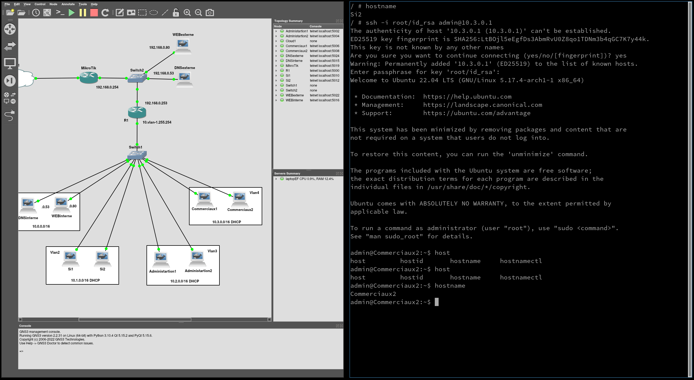
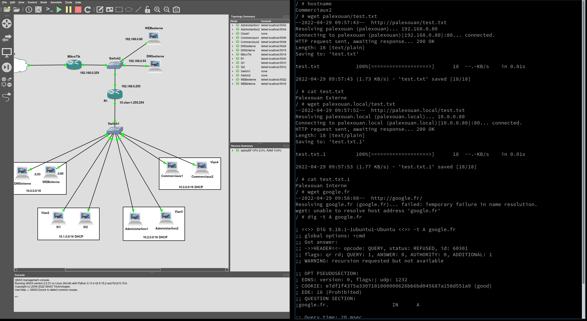
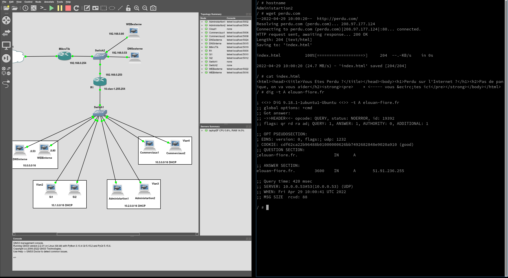
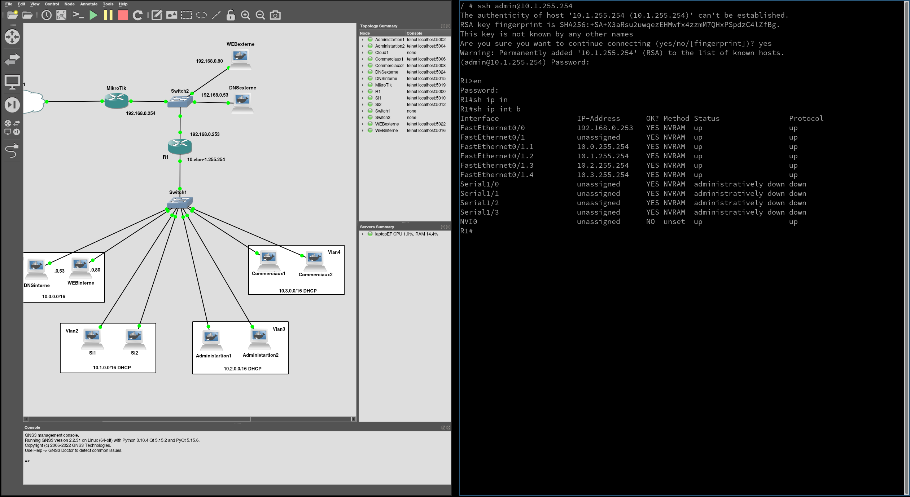
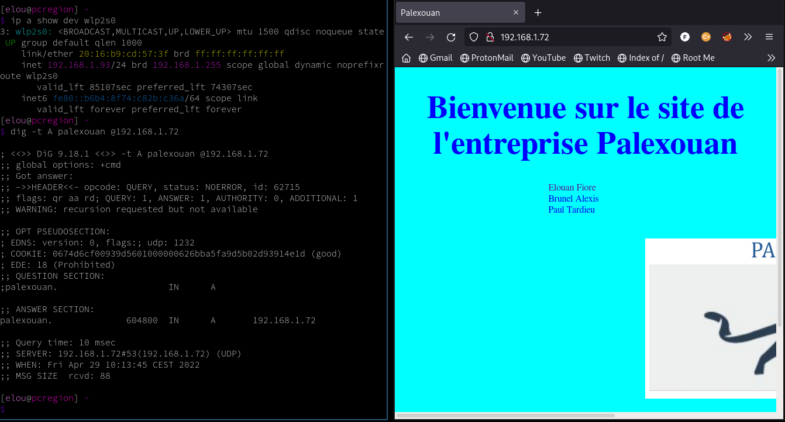

# SAE21-groupe-Elouan-Alexis-Paul

- [SAE21-groupe-Elouan-Alexis-Paul](#sae21-groupe-elouan-alexis-paul)
  - [L'adressage](#ladressage)
    - [Dans l'intranet](#dans-lintranet)
    - [Dans la DMZ](#dans-la-dmz)
    - [Dynamique/Statique](#dynamiquestatique)
  - [Les machines](#les-machines)
    - [Routeurs](#routeurs)
    - [Serveurs WEB](#serveurs-web)
    - [Serveurs DNS](#serveurs-dns)
      - [Interne](#interne)
      - [Externe](#externe)
    - [Utilisateurs](#utilisateurs)
  - [Les restrictions](#les-restrictions)
    - [Les ACL](#les-acl)
    - [Le NAT/DNAT](#le-natdnat)
    - [Le pare-feu](#le-pare-feu)
  - [Gestion des mots de passe](#gestion-des-mots-de-passe)
  - [Les configurations](#les-configurations)
    - [Routeur Cisco](#routeur-cisco)
    - [Routeur Mikrotik](#routeur-mikrotik)
    - [WEB](#web)
      - [Interne](#interne-1)
      - [Externe](#externe-1)
    - [DNS](#dns)
      - [Interne](#interne-2)
      - [Externe](#externe-2)
    - [PC SI](#pc-si)
    - [PC Autres](#pc-autres)
  - [Les limites](#les-limites)
  - [Schéma](#schéma)
  - [Quelques captures d'écrans](#quelques-captures-décrans)
  - [Mettre en place sur GNS3](#mettre-en-place-sur-gns3)
  - [Liens Repositories Github](#liens-repositories-github)

## L'adressage
### Dans l'intranet
La base de tout le projet est l'adressage, nous partons avec une base d'adresse privée en 10.0.0.0/8 pour l'intranet ce qui nous donne plus de flexibilité pour les sous-réseaux. Nous choisissons ensuite de créer un sous-réseau par vLan et de lui attribuer les adresses dans la plage 10.vLan-1.0.0/16. Ce qui nous donne la possibilité de faire 256 vLan contenant chacun 65 534 machines ou de découper ces sous-réseaux en d'autres sous-réseaux aux besoins.

L'adressage est le suivant :

Service | vLan | Sous-réseau 
--------|--------|-------
Serveur | vLan 1 | 10.0.0.0/16
Informatique | vLan 2 | 10.1.0.0/16
Administartion | vLan 3 | 10.2.0.0/16
Commercial | vLan 4 | 10.3.0.0/16

### Dans la DMZ
La DMZ est une zone contenant les serveurs accessibles publiquement, elle doit donc normalement contenir des adresses IP publiques. Pour l'exercice, nous avons pris des adresses privées en 192.168.0.0/24. Le routeur Mikrotik fera du DNAT pour rendre accessibles les serveurs WEB (192.168.0.80) et DNS (192.168.0.53) par son adresse externe. La patte DMZ du routeur DMZ/Intranet aura l'adresse 192.168.0.253 et la patte DMZ du routeur Internet/DMZ aura l'adresse 192.168.0.254.

### Dynamique/Statique
Il est demandé que les adresses des postes clients soient attribuées dynamiquement. Nous avons donc configuré un serveur DHCP sur le routeur Cisco, car c'est l'option la plus simple. Plutôt que de déployer un serveur DHCP dédié avec une configuration complexe et de faire un relai DHCP dans chaque vLan. Les serveurs sont adressés de manière statique avec des adresses en .80 et .53 pour le WEB et le DNS. Les interfaces de routeurs ont par convention la dernière adresse disponible de la plage avant l'adresse broadcast.

## Les machines
À part les routeurs, toutes les machines ont été construites dans une image Docker, ce ne sont pas des images faites pour être optimisées, car elles contiennent un serveur SSH et un utilisateur admin. Elles reproduisent au mieux une machine physique et les Dockerfiles permettent de voir le processus qu'on aurait utilisé pour déployer ces services sur des machines physiques.

### Routeurs
Le routeur faisant Internet/DMZ restera un routeur Mikrotik. Pour le routeur DMZ/Intranet, nous avons choisi un routeur Cisco, car ils sont majoritairement présents dans les systèmes informatiques d'entreprises, ils possèdent beaucoup de ressources et de documentations en ligne et sont facilement intégrables dans GNS3. Les deux routeurs sont accessibles via SSH. Une route statique par défaut vers le routeur Mikrotik est établie sur le routeur Cisco, c'est plus simple que de configurer et utiliser un protocole de routage comme OSPF pour seulement une route.

### Serveurs WEB
Nous avons vu en cours comment configurer un serveur Apache2. Mais nous avons décidé de partir sur Nginx, car comparé à Apache2 (qui est vieillissant) il est plus répandu de nos jours et est souvent utilisé sur des serveurs en productions. Cela nous permet aussi de voir un fonctionnement et une configuration différente. Les deux serveurs WEB (interne et externes) sont accessibles via SSH.

### Serveurs DNS
Nous avons pris Bind9, pour sa documentation riche et sa grande communauté en ligne qui nous a aidés. Nous avons aussi fait le choix d'avoir deux serveurs DNS. Ils sont aussi accessibles en SSH.

#### Interne
En interne, il possède les zones "palexouan.local." et "palexouan.", il fait aussi de la récursion seulement pour des clients dans une plage d'adresse spécifique, pour permettre aux utilisateurs de faire des requêtes DNS qui ne sont pas dans sa zone. La zone "palexouan." contiens l'adresse privée du serveur WEB (192.168.0.80) dans la DMZ pour ne pas que le client WEB fasse une requête vers l'adresse publique et que ce soit l'adresse privée qui lui réponde.

#### Externe
Le DNS externe qui est disponible au publique ne fait pas de récursion, la seule zone qu'il possède est "palexouan.". Les adresses de cette zone sont toutes l'adresse de la patte externe du routeur Mikrotik car il fait du DNAT. La zone est changeable sans refaire le fichier "db.palexouan" grâce au script "entrypoint.sh" qui au démarrage du conteneur va réécrire le fichier avec l'adresse contenu dans la variable d'environnement IP. Alors il n'y a plus besoin de refaire les configurations chaque fois que l'IP assignée au routeur Mikrotik change.

### Utilisateurs
Chaque PC d'utilisateur contient des outils comme hping3, dig ou wget pour faire des tests. Ils ont aussi (sauf pour le SI) un serveur SSH avec un compte admin qui est accessible seulement en s'authentifiant avec une clé privé présente sur les PC du SI. Les PC du SI ont aussi une configuration spéciale pour pouvoir SSH le routeur Cisco. 

## Les restrictions
Malgré le fait que le sujet corrigé dit que les commerciaux doivent avoir accès à Internet, comme nous avions déjà configuré les ACL, nous avons décidé de les laisser ainsi. Cela permet de voir comment on aurait fait pour appliquer de telles restrictions sur un vLan tout en laissant la liberté de consulter les serveurs WEB, interne et externe.

### Les ACL
Pour restreindre la communication entre les vLan nous avons mit en place des règles en entrée et en sortie de chaque sous-interface du routeur Cisco présente dans un vLan.

### Le NAT/DNAT
Un premier NAT permet de passer de l'intranet à la DMZ et un deuxième de la DMZ à Internet. Le DNAT lui permet de rediriger les ports 80 et 53 de l'interface externe du routeur Mikrotik vers les serveurs WEB et DNS présents dans la DMZ. De ce fait depuis l'extérieur avec la supposée adresse IP publique du routeur Mikrotik, on peut accéder au serveur WEB en HTTP et faire des requêtes DSN sur la zone "palexouan.".

### Le pare-feu
Le pare-feu sur le routeur permet aux connexions déjà établies/relatives à d'autres connexions de passer et aux nouvelles connexions de s'initier seulement si elles viennent de la patte intérieure ou qu'elles correspondent une règle de DNAT. Une règle permet aussi de filtrer les paquet entrant pour n'accepter que le SSH depuis l'adresse externe du routeur Cisco (donc depuis le vLan SI après le NAT car seul les ACLs du SI permettent au SSH de sortir).

## Gestion des mots de passe
Tous les mots de passe (compte administrateur, clé SSH, routeur Mikrotik, routeur Cisco) sont complexes et ont été générés et gardés par le gestionnaire de mot de passe KeepassXC dont le mot de passe est SAE21_G3.

## Les configurations
Voici les liens vers les fichiers de configurations de chaque machine avec des commentaires qui permettent de mieux comprendre comment nous avons mis en place nos solutions.

### Routeur Cisco
* [ACL](./Cisco/acl.txt)
* [NAT](./Cisco/nat.txt)
* [SSH](./Cisco/ssh.txt)
* [DHCP](./Cisco/dhcp.txt)
* [show run](./Cisco/cisconf.txt) Non commenté mais contient des configurations déjà vu et d'autres évidentes commes les sous interfaces ou la route par défaut.

### Routeur Mikrotik
* [Pare-feu](./Mikrotik/parefeu.txt)
* [NAT/DNAT](./Mikrotik/nat.txt)
* [SSH](./Mikrotik/ssh.txt)
* [/export](./Mikrotik/mikroconf.txt) Non commenté mais contient des configurations déjà vu et d'autres évidentes commes le client DHCP sur l'interface exterieur.

### WEB 
* [Dockerfile](./nginx/externe/Dockerfile)
* [Entrypoint](./nginx/externe/entrypoint.sh)
* [sshd_config](./nginx/externe/sshd_config)

#### Interne
* [nginx.conf](./nginx/interne/nginx.conf)

#### Externe
* [nginx.conf](./nginx/externe/nginx.conf)

### DNS
* [Dockerfile](./bind/externe/Dockerfile)
* [sshd_config](./bind/externe/sshd_config)

#### Interne
* [Entrypoint](./bind/interne/entrypoint.sh)
* [named.conf.local](./bind/interne/conf/named.conf.local)
* [named.conf.options](./bind/interne/conf/named.conf.options)
* [db.palexouan](./bind/interne/conf/db.palexouan)
* [db.palexouan.local](./bind/interne/conf/db.palexouan.local)
  
#### Externe
* [Entrypoint](./bind/externe/entrypoint.sh)
* [named.conf.local](./bind/externe/conf/named.conf.local)
* [named.conf.options](./bind/externe/conf/named.conf.options)
* [template.palexouan](./bind/externe/conf/template.palexouan)

### PC SI
* [Dockerfile](./machine/SI/Dockerfile)
* [ssh.conf](./machine/SI/ssh.conf)

### PC Autres
* [Dockerfile](./machine/Autres/Dockerfile)
* [sshd_config](./machine/Autres/sshd_config)

## Les limites
Un des points faibles que nous avons pu identifier est que nous avons autorisé le serveur DNS interne à recevoir et à envoyer n'importe quoi à n'importe qui en UDP. Un attaquant qui aurait compromis le serveur pourrait y ouvrir un canal en UDP et s'en servir de point de pivot pour d'autres attaques. Nous n'avons pas eu le temps pour combler cette lacune, une des solutions est d'autoriser dans les ACL la communication seulement vers l'adresse des serveurs DNS racines.

## Schéma

## Quelques captures d'écrans
<<<<<<< HEAD
1. Un PC du SI peut se connecter en SSH sur un PC des commerciaux.
=======
1. Un PC du SI peu se connecter en SSH sur un PC des Commerciaux.
>>>>>>> temp

2. Un PC des commerciaux a accès aux serveurs de l'entreprise mais pas à Internet.

<<<<<<< HEAD
3. Un PC de l'administration a accès à tout les serveurs web.
=======
3. Un PC de l'administration à accès à tout les serveurs web.
>>>>>>> temp

4. Un PC du SI peu se connecter en SSH sur le routeur Cisco.

5. Un poste externe au réseau peu faire des requêtes DNS et acceder au serveur web publique.

## Mettre en place sur GNS3
Si jamais les images Docker ne sont pas correctements importés par GNS3 et qu'il en manque, il suffit de cloner le repositories et lancer le script [buildAll.sh](./buildAll.sh) qui va construire toutes les images. Le fichier GNS3 est aussi sur moodle.

## Liens Repositories Github
* [Repo Paul](https://github.com/Mendrick/SAE21-Paul-TARDIEU)
* [Repo Alexis](https://github.com/AlexisBrunel/SAE21-AlexisBrunel)
* [Repo Elouan](https://github.com/ElouanFiore/SAE21_FIORE)